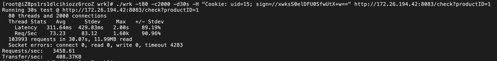
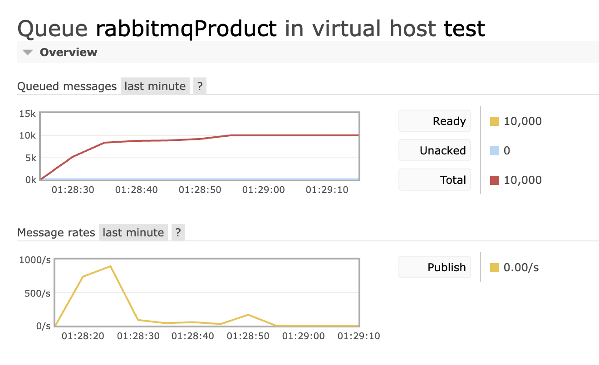

# Go High Concurrency

## Project Structure
1. model
2. repositories
3. services
4. controllers
5. views

## Data Flow
<p align="center"></p> 

## Improvements
### Bidirectional Encryption
* Use Cookie instead of Session to reduce request consumption under heavy traffic.
* Encrypt Cookie with Advanced Encryption Standard(AES-128).
### Distributed System
* Server Load Balancer(SLB) - Consistent Hashing 
* Add virtual server node on the hash ring to ensure fairness.
* Use Binary Search to find the IP address of the corresponding server according to the hash value of key to realize SLB.
### RabbitMQ
* Use RabbitMQ instead of Redis to improve the Queries Per Second(QPS) of each product. 
### Traffic Control
1. Front-end
* Users must log in before shopping.
* Users can only click the purchase button once every 10 seconds.
* Captcha: verification is required when click buy-now-button and refresh captcha frequently.
2. Back-end
* Server responds to requests every 10 seconds.
* Add blacklist.
* Add Token Bucket: 
<br> "/check" : time/rate, token is generated every millisecond and token bucket size is 1000.
<br> "/product" : middleware, token is generated every millisecond and token bucket size is 10000.


## Test
### Servers
1. Server Zone: Malaysia (Kuala Lumpur)
2. Server Image: CentOS  7.6 64 bit, 1vCPU(s) 512 MB memory
3. Maximum Bandwidth: 100Mbps
4. IP Addresses

   | Server Name      |  Intranet IP  |      Public IP |
   |:-----------------|:-------------:|---------------:|
   | Validate1 + SLB  | 172.26.194.42 |   47.250.49.25 |
   | Validate2 + SLB  | 172.26.194.41 | 47.250.147.115 |
   | Stress Test      | 172.17.169.89 | 47.250.131.235 |
   | Quantity Control | 172.26.194.43 | 47.250.144.234 |
   | RabbitMQ Simple  | 172.17.169.88 |  47.254.251.25 |

5. Cross Compile
```go
GOOS=linux GOARCH=amd64 go build xxx.go
```
### WRK
Set product number 10000, WRK result:
<p align="center"></p>
RabbitMQ queue information:
<p align="center"></p>
The 10,000 flash sale products were sold within 10 seconds. 
Quantity control is functioning properly. 
The bottleneck of running is the publishing rate of RabbitMQ.
When the product number is large, we can set the Rabbitmq queue for every 100 requests.

## Environment
Go 1.18.1 arm64
<br>IRIS 11.1.1
<br>Mysql 8.0.31
<br>RabbitMQ 3.11.11